# Data Disarray

## Extracting and Making Sense of OSM Data
By Christy Heaton

## Where I work

[`SGSI`](http://www.sgsi.com) - Schlosser Geographic Systems Inc

_VAR of Pitney Bowes products_<!-- .element: class="fragment" data-fragment-index="1" -->

_Spectrum Spatial for Web Mapping_<!-- .element: class="fragment" data-fragment-index="2" -->

_MapInfo Pro for Desktop Mapping_<!-- .element: class="fragment" data-fragment-index="3" -->

_Custom applications_<!-- .element: class="fragment" data-fragment-index="4" -->

## The Project

A world base map

_Using Spectrum Spatial_<!-- .element: class="fragment" data-fragment-index="1" --> 

_Need data in TAB format_<!-- .element: class="fragment" data-fragment-index="2" -->

_We have Pitney Bowes US base map data_<!-- .element: class="fragment" data-fragment-index="3" -->

_But we needed data for the rest of the world_<!-- .element: class="fragment" data-fragment-index="4" -->

# Enter [`Open Street Map`](http://www.openstreetmap.org/)

## What is [`Open Street Map`](http://www.openstreetmap.org/)?

## Free and editable web map
_Crowd sourced!_<!-- .element: class="fragment" data-fragment-index="1" --> 

## You can contribute to it
_Like Wikipedia!_<!-- .element: class="fragment" data-fragment-index="1" --> 

## You can extract data from it
_For free!_<!-- .element: class="fragment" data-fragment-index="1" --> 

## Here it is!

## The Plan

_Download Open Street Map data into some kind of database_<!-- .element: class="fragment" data-fragment-index="1" -->

_Convert to TAB format_<!-- .element: class="fragment" data-fragment-index="2" -->

_Add to Spectrum Repository_<!-- .element: class="fragment" data-fragment-index="3" -->

_Style per customer request_<!-- .element: class="fragment" data-fragment-index="4" -->

_`Web maps!`_<!-- .element: class="fragment" data-fragment-index="5" -->

## Processing

_Downloaded data into PostGIS databases_<!-- .element: class="fragment" data-fragment-index="1" -->

_One per country so they weren't too big_<!-- .element: class="fragment" data-fragment-index="2" -->

_Python script to extract all the data_<!-- .element: class="fragment" data-fragment-index="3" -->

_Add to Spectrum Spatial repository_<!-- .element: class="fragment" data-fragment-index="4" -->

## More on my Python script

## Uses QGIS
Must be run in the Python window in QGIS

## QGIS Modules
Difficult because documentation is limited

## I wrote a [`first version`](https://github.com/christyheaton/PostGIS_Tab_Convert/blob/master/Export_All.py)

Not Customized

Pulled out all data

Datasets too large

## So I wrote a [`much longer custom version`](https://github.com/christyheaton/PostGIS_Tab_Convert/blob/master/Export_Custom.py)

Smaller datasets

Pulled out just what we needed into separate files

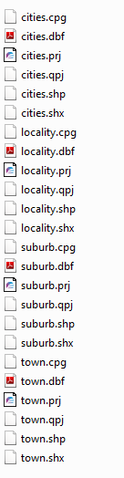

## Processing

Downloaded data into PostGIS databases

One per country to reduce file size

Python script to extract all the data

Add to Spectrum Spatial repository

# Problems!

## Translation to TAB format from postGIS did not project correctly
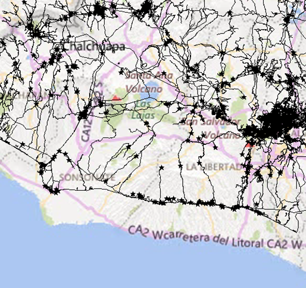

## Some datasets were huge, produced incomplete results
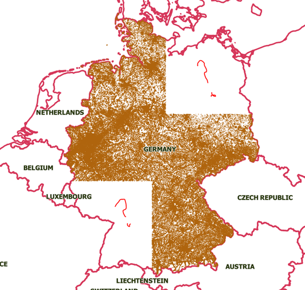

## Roads database table only had major roads
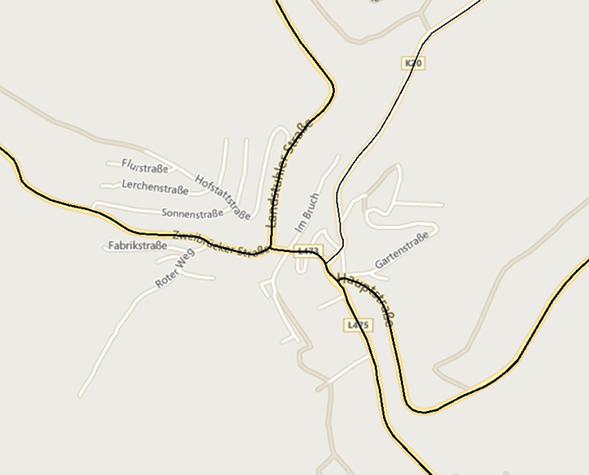

## Tags did not extract as much as we wanted

living_street??

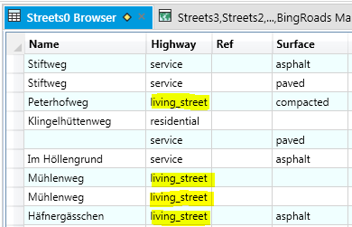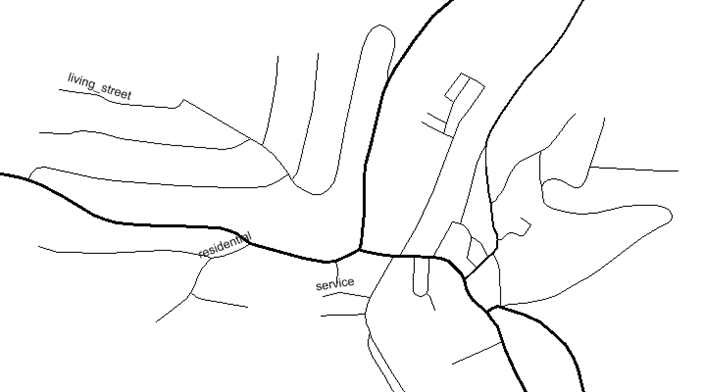

## Points of interest were not what we needed

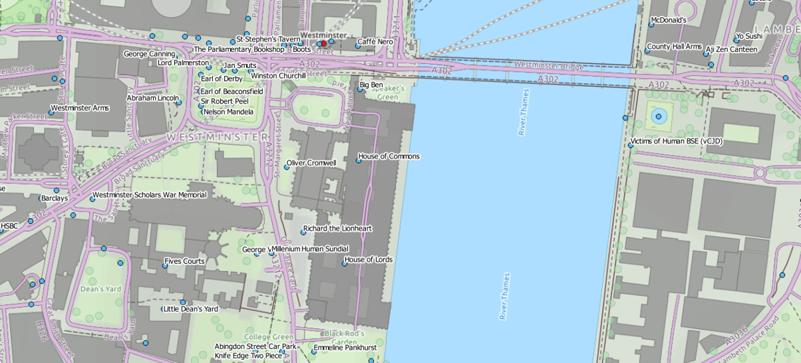

## Large rivers were missing

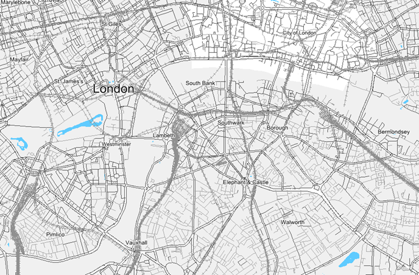

## All place names had to be in English

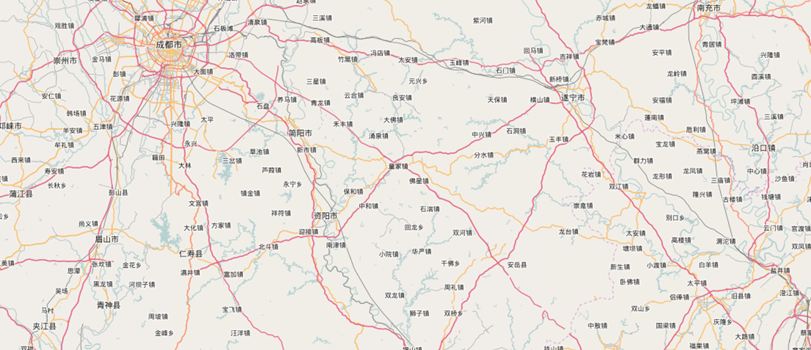

# Fixes

## Used FME Universal Translator
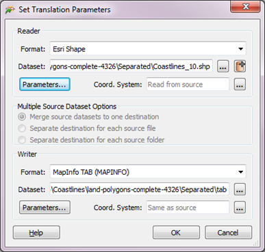

## Split tables up and modified script
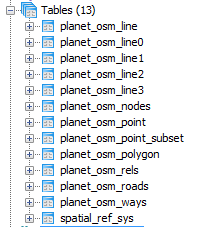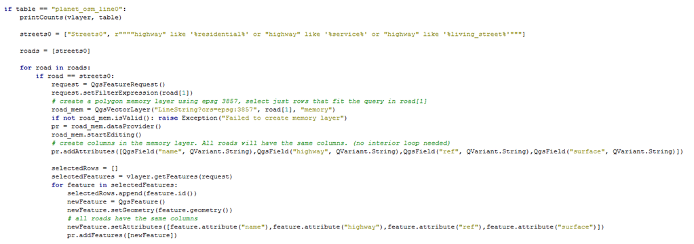

## Took smaller roads from Line table
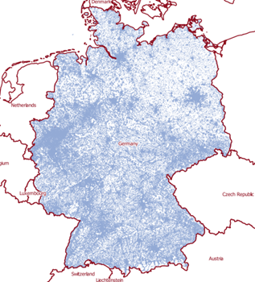

## Changed tags on roads and water
water is not null or waterway = 'riverbank' or waterway = 'channel' or waterway = 'fishing_lake' or waterway = 'lake' or waterway = 'moat' or waterway = 'mill_pond' or waterway = 'pond' or waterway = 'reservoir' or waterway = 'river' or waterway = 'stream' or waterway = 'water' or waterway = 'waterfall' or waterway = 'yes' or 'waterway' = 'weir' or waterway = 'marina' or waterway = 'mooring' or "natural" like '%bay%' or  "natural" like '%water%' or  "landuse" = 'reservoir'

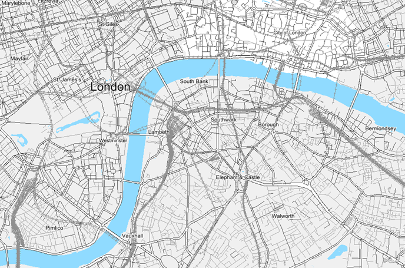

			
## Used Points of Interest from customer list
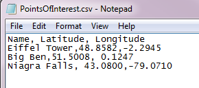

## Obtained place names from another source
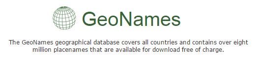

## Lessons Learned

_Choose tags carefully_<!-- .element: class="fragment" data-fragment-index="1" -->

_Be aware of file size_<!-- .element: class="fragment" data-fragment-index="2" -->

_Consider projection_<!-- .element: class="fragment" data-fragment-index="3" -->

_Automate processing_<!-- .element: class="fragment" data-fragment-index="4" -->

_Be flexible_<!-- .element: class="fragment" data-fragment-index="5" -->

## The Moral of the Story

### It is okay because I learned a lot!

_PostGIS, pgAdmin, and SQL_<!-- .element: class="fragment" data-fragment-index="1" -->

_QGIS Desktop and QGIS Python_<!-- .element: class="fragment" data-fragment-index="2" -->

_OpenStreetMap Data_<!-- .element: class="fragment" data-fragment-index="3" -->

_SHP to TAB conversion_<!-- .element: class="fragment" data-fragment-index="4" -->

_Regular Expressions_<!-- .element: class="fragment" data-fragment-index="5" -->

_Git and GitHub_<!-- .element: class="fragment" data-fragment-index="6" -->

## More Information

Check out my GitHub!

## Thank you!

alukach of Maptime Calgary for this presentation template

My friends at CUGOS

MaptimeSEA crew 

and others who have helped me!