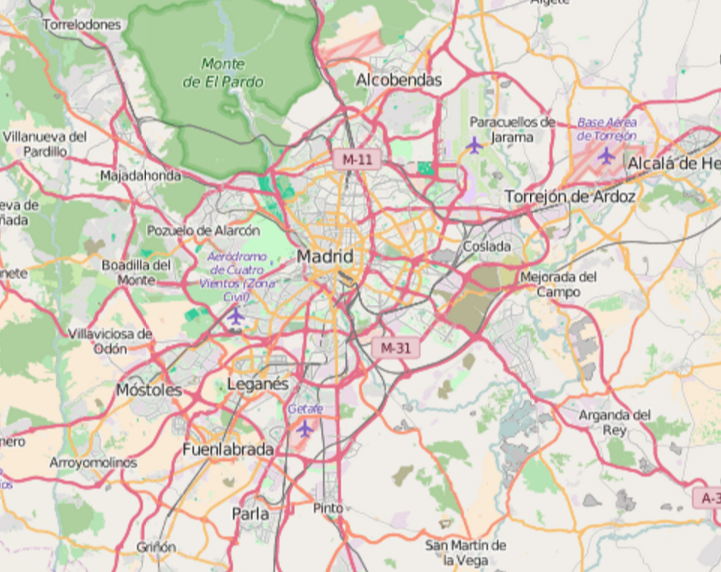
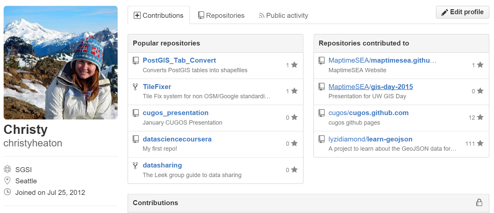

# Data Disarray

## Extracting and Making Sense of OSM Data
By Christy Heaton

## Where I work

[`SGSI`](http://www.sgsi.com) - Schlosser Geographic Systems Inc

_VAR of Pitney Bowes products._<!-- .element: class="fragment" data-fragment-index="1" -->

_Spectrum Spatial for Web Mapping._<!-- .element: class="fragment" data-fragment-index="2" -->

_MapInfo Pro for Desktop Mapping._<!-- .element: class="fragment" data-fragment-index="3" -->

_Custom applications._<!-- .element: class="fragment" data-fragment-index="4" -->

## The Project

A world base map.

_Using Spectrum Spatial_<!-- .element: class="fragment" data-fragment-index="1" --> 

_Need data in TAB format_<!-- .element: class="fragment" data-fragment-index="2" -->

_We have Pitney Bowes US base map data_<!-- .element: class="fragment" data-fragment-index="3" -->

_But we needed data for the rest of the world_<!-- .element: class="fragment" data-fragment-index="4" -->

# Enter [`Open Street Map`](http://www.openstreetmap.org/)

## What is [`Open Street Map`](http://www.openstreetmap.org/)?

## Free and editable web map.
_Crowd sourced!_<!-- .element: class="fragment" data-fragment-index="1" --> 

## You can contribute to it.
_Like Wikipedia!_<!-- .element: class="fragment" data-fragment-index="1" --> 

## You can extract data from it
_For free!_<!-- .element: class="fragment" data-fragment-index="1" --> 

## Here it is!

## The Plan

_Download Open Street Map data into some kind of database_<!-- .element: class="fragment" data-fragment-index="1" -->

_Convert to TAB format_<!-- .element: class="fragment" data-fragment-index="2" -->

_Add to Spectrum Repository_<!-- .element: class="fragment" data-fragment-index="3" -->

_Style per customer request_<!-- .element: class="fragment" data-fragment-index="4" -->

_`Web maps!`_<!-- .element: class="fragment" data-fragment-index="5" -->

## Processing

_Downloaded data into PostGIS databases._<!-- .element: class="fragment" data-fragment-index="1" -->

_One per country so they weren't too big._<!-- .element: class="fragment" data-fragment-index="2" -->

_Python script to extract all the data._<!-- .element: class="fragment" data-fragment-index="3" -->

_Add to Spectrum Spatial repository._<!-- .element: class="fragment" data-fragment-index="4" -->

## More on my Python script

_Since this is CUGOS. :-)_<!-- .element: class="fragment" data-fragment-index="1" -->

## Uses QGIS
Must be run in the Python window in QGIS

## QGIS Modules
Difficult because documentation is limited

## I learned and teach the arcpy module
Tons of documentation!

## I wrote a first version
Not Customized
Pulled out all data
Datasets too large

## So I wrote a much longer custom version

Smaller datasets

Pulled out just what we needed into separate files

## Processing

Downloaded data into PostGIS databases.

One per country so they weren't too big.

Python script to extract all the data.

Add to Spectrum Spatial repository.

# Problems!

## Translation to TAB format from OSM data did not work (TAB exporter is old and bad).

IMAGE

## Some datasets were huge, produced bad results.

IMAGE

## Roads database table only had major roads.

IMAGE

## Tags did not extract as much as we wanted.

Streets = "highway" like '%residential%' or "highway" like '%service%'

living_street??

IMAGE

## Points of interest were not what we needed.

IMAGE

## Large rivers were missing.

IMAGE

## All place names had to be in English

IMAGE

## Customer needs kept changing.

IMAGE

# Fixes

## Used FME Universal Translator.

## Split tables and modified script.

## Took smaller roads from Line table.

## Changed tags on roads and water.

## Used Points of Interest from customer list.

## Obtained place names from another source.

## Lessons Learned

_Choose tags carefully_<!-- .element: class="fragment" data-fragment-index="1" -->

_Be aware of file size_<!-- .element: class="fragment" data-fragment-index="2" -->

_Consider projection_<!-- .element: class="fragment" data-fragment-index="3" -->

_Automate processing_<!-- .element: class="fragment" data-fragment-index="4" -->

_Be flexible_<!-- .element: class="fragment" data-fragment-index="5" -->

## The Moral of the Story

### It is okay because I learned a lot!

_MapInfo and Spectrum_<!-- .element: class="fragment" data-fragment-index="1" -->

_PostGIS and SQL_<!-- .element: class="fragment" data-fragment-index="2" -->

_QGIS Desktop and QGIS Python_<!-- .element: class="fragment" data-fragment-index="3" -->

_OpenStreetMap Data_<!-- .element: class="fragment" data-fragment-index="4" -->

_SHP to TAB conversion_<!-- .element: class="fragment" data-fragment-index="5" -->

## More Information

Check out my GitHub!

### Thank you!
alukach of Maptime Calgary for this presentation template

CUGOS

MaptimeSEA crew 

and others who have helped me!